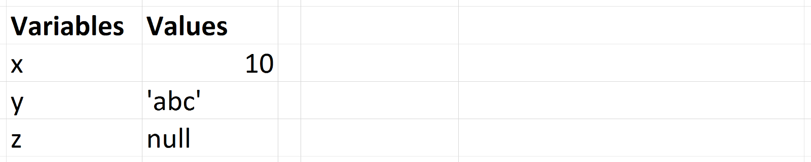
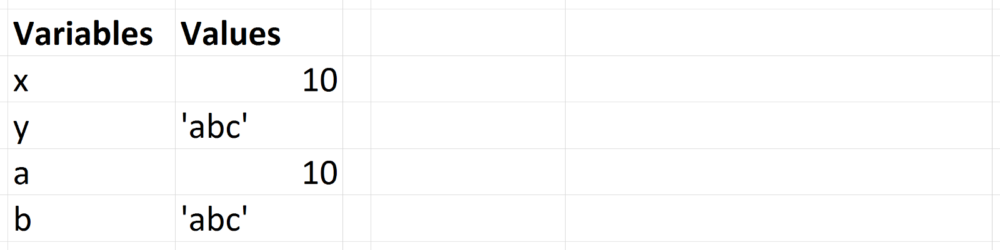

# TIPI DI DATI

---

<em>"Primitive Data Types are passed By Value and Objects are passed By Reference."</em>

---

## Tipi Primitivi

- Numeri
- Stringhe
- Booleani
- `null`
- `undefined`
- Object
- Symbol

---

## Numeri

- interi: 1, 2, -3
- reali: 0.2, .3, -1.5...
- notazione scientifica: 1.333e9
- numeri in base 2: 0b10010
- numeri in base 8: 0777
- numeri in base 16: 0xff
- Infinity: 5/0
- NaN (Not a Number): 0/0, 3 \* "a"

---

## Stringhe

- "ciao"
- 'ciao'
- "Erano i capei d'oro a l'aura sparsi"
- 'Erano i capei d\'oro a l\'aura sparsi'

---

## Booleani

- true, false
- false, 0, "", null, undefined e NaN sono valutati come false
- tutto il resto come true (anche "0", "false", [], {})

---

## Tipi speciali

- _`null`_: valore inesistente o vuoto (quando assegnato volutamente)

- `undefined`: variabile dichiarata ma senza valore assegnato

---

## Tipi Oggetti

- Array

- Function

- Object

---

## Array

E’ possibile creare collezioni di elementi fondamentali raggruppandoli in una lista, ovvero un array:

- var arr = []

- var arr = new Array()

- var firstArray = ['Hello', 89, false, true];

---

## Oggetti

Uno dei tipi più importanti in JavaScript è Object. L’oggetto è il pilastro su cui si regge il linguaggio.
Gli oggetti sono “contenitori” di valori ed ogni valore può essere associato ad una chiave. Le chiavi
prendono il nome di proprietà dell’oggetto. Gli oggetti in JavaScript sono definiti come nel seguente
esempio dove le parentesi graffe { } rappresentano il contenitore mentre name ed age sono le
proprietà (dette anche chiavi):

```javascript
{
  name: "Alex",
  age: 33
}
```

---

Per mantenere un oggetto in memoria possiamo assegnarlo ad una variabile:

```javascript
var firstObj = {
  name: "Alex",
  age: 33
};
```

---

Questo modo di creare oggetti JavaScript è definito “letterale”. Esiste anche un altro metodo, ma è
molto meno diffuso e lo incontrerai raramente:

```javascript
var firstObj = new Object({
  name: "Alex",
  age: 33
});
```

---

Il motivo per cui creiamo oggetti JavaScript è quello di poter accedere (e modificare) i valori contenuti
all’interno. Continuando con il nostro esempio possiamo estrarre il nome da firstObj con:

```javascript
firstObj.name;
firstObj.age;
```

---

oppure aggiungere una nuova proprietà sull’oggetto:

```javascript
firstObj.address = "Some fancy address";
```

---

Le chiavi di un oggetto possono anche essere composte da stringhe più complesse o da
numeri:

```javascript
var anotherObj = {
  "alex muraro": "333335685454",
  88: "554234242"
};
```

---

In questo caso però si accede ad ogni valore con una sintassi diversa, detta “bracket notation”:

```javascript
anotherObj["alex muraro"];
anotherObj[88];
```

---

## Funzioni

```javascript
const foo = function() {};
```

---

## Tipi Primitivi passati per Valore

Se un tipo Primitivo è assegnato ad una variabile, possiamo pensare che quella variabile contiene quel valore

```javascript
var x = 10;
var y = "abc";
var z = null;
```



---

Quando assegniamo queste variabili ad altre variabili usando =, noi copiamo il valore nella nuova variabile. Abbiamo copiato per valore.

```javascript
var x = 10;
var y = "abc";
var a = x;
var b = y;
console.log(x, y, a, b); // -> 10, 'abc', 10, 'abc'
```



---

Cambiando uno non cambia l'altro. Pensa che le variabili non hanno alcuna relazione l'una con l'altra.

```javascript
var x = 10;
var y = "abc";
var a = x;
var b = y;
a = 5;
b = "def";
console.log(x, y, a, b); // -> 10, 'abc', 5, 'def'
```

---

## Oggetti passati per Riferimento

Alle variabili a cui è assegnato un valore non primitivo viene assegnato un riferimento a tale valore. Questo riferimento punta alla posizione dell'oggetto nella memoria. Le variabili in realtà non contengono il valore.
Gli oggetti vengono creati in qualche punto nella memoria del computer. Quando scriviamo arr = [], abbiamo creato una matrice in memoria. Ciò che la variabile arr riceve è l'indirizzo, la posizione, di quella matrice.

---

```javascript
var myName = {
  firstName: "Carlos"
};
var identity = myName;
myName.firstName = "Carla";
console.log(myName.firstName); // "Carla"
console.log(identity.firstName); // "Carla"
```

Quando si lavora con oggetti, l'operatore = crea un alias per l'oggetto originale, non crea un nuovo oggetto. Questo è ciò che significa "per riferimento".

---

## Passare Tipi Primitivi e Oggetti ad una Funzione

Se modifichi il valore di un Tipo Primitivo dentro una funzione, questa modifica non avrà effetto sulla variabile al di fuori di quella funzione.

```javascript
var myName = "Carlos";
function myNameIs(aName) {
  aName = "Carla";
}
myNameIs(myName);
console.log(myName); // "Carlos"
```

---

Anche se stiamo cambiando la variabile myName all'interno della funzione myNameIs, quando la stampiamo dopo aver chiamato la funzione, ha ancora il valore "Carlos". Questo perché i tipi primitivi vengono passati per valore.

Stiamo passando una copia di myName: tutto ciò che fa myName all'interno del corpo della funzione non influenzerà myNamevariable nell'ambito globale perché si sta passando una copia di myName e non la variabile myName originale.

---

## Oggetti passati ad una funzione per riferimento

Quando si passa qualcosa per riferimento, si sta passando qualcosa che indica qualcos'altro, non una copia dell'oggetto. Quindi, dal momento che JavaScript passa gli oggetti per riferimento, quando si modifica una proprietà di tale oggetto all'interno della funzione, la modifica verrà riflessa nell'ambito esterno:

```javascript
var myName = {};
function myNameIs(aName) {
  aName.firstName = "Carla";
}
myNameIs(myName);
console.log(myName); // Object {firstName: "Carla"}
```

---

```javascript
var myName = {
  firstName: "Carla"
};
function myNameIs(aName) {
  aName = {
    nickName: "Carlita"
  };
}
myNameIs(myName);
console.log(myName); // Object {firstName: "Carla"}
```

Qui stampa il valore della variabile myName nello scope esterno e questa volta non ha aggiunto una proprietà nickName all'oggetto. Perché ? Se si guarda attentamente, ciò che stiamo facendo nella funzione sta tentando di riassegnare all'oggetto myName un nuovo valore.

---

Ma non puoi cambiare a cosa punta myName, puoi solo cambiare una proprietà di myName in qualcos'altro, come in questo caso:

```javascript
var myName = {
  firstName: "Carla"
};
function myNameIs(aName) {
  aName.nickName = "Carlita";
}
myNameIs(myName);
console.log(myName); // Object {firstName: "Carla", nickName: "Carlita"}
```

---

# OPERATORI E COMPARAZIONI

---

## Operatori

- aritmetici (+, -, \*, /, %, ++, --)
- assegnazione ( =, +=, -=, \*=, /=, %=)
- il '+' con le stringhe effettua concatenazione!
- comparazione (==, ===, !=, !==, <, > <=, >=)
- logici (&&, ||, !)
- condizionale (variabile = (condizione) ? valore1 : valore2)
- operazioni su bit (&, |, ~, ^, <<, >>) // raramente serviranno
- typeof

---

## Conversioni automatiche (occhio!)

- (8 \* null) // 0
- ("5" - 1) // 4
- ("5" + 1) // 51
- ("five" \* 2) // NaN
- (false == 0) // true
- Array(16).join("lol" - 2) + " Batman!" // :)

---

## Comparare i Booleani

- (false == 0); // true
- (false == ""); // true
- (0 == ""); // true
- (null == false); // false
- (null == null); // true
- (undefined == undefined); // true
- (undefined == null); // true
- (NaN == null); // false
- (NaN == NaN); // false
- (2 == "2"); // true !
- (12 == 1 + "2"); // true !!

---

## Un gran macello!

Per sicurezza nelle comparazioni è meglio utilizzare === e !== che restituiscono
l'uguaglianza solo se i dati sono effettivamente identici

- ("ciao" === "ciao"); // true
- (2.0 === 2); // true
- (NaN === NaN); // false!! :O (maggiori info [qui](https://ariya.io/2014/05/the-curious-case-of-javascript-nan))
- (null === null); // true
- (null === undefined); // false

---

# STRUTTURE DI CONTROLLO

---

## if, then, else

```javascript
if (condizione) { // se la condizione è vera
  fai qualcosa;
} else { // altrimenti
  fai qualcos'altro;
}
```

Es.

```javascript
if (3 > 2) {
  console.log("3 è maggiore di 2");
} else {
  console.log("la matematica è impazzita");
}
```

---

## while

```javascript
while (condizione) { // finchè la condizione rimane vera
  fai qualcosa;
}
```

Es.

```javascript
var i = 0;
while (i <= 10) {
  console.log(i);
  i++;
}
```

---

## for

```javascript
for (dichiarazione; condizione; incremento) {
  fai qualcosa;
}
```

Es.

```javascript
for (var i = 0; i <= 10; i++) {
  console.log(i);
}
```

---

## switch

```
switch (espressione) {
  case "a":
    istruzione;
    break;
  case "b":
    istruzione;
    break;
  default:
    istruzione di default
}
```

In base al valore dell'espressione verrà eseguito il codice **A PARTIRE**
dal caso corrispondente. Per questo sono necessari i break.

---

## for-in

```javascript
for (key in obj) {
  fai qualcosa con key;
}
```

Permette di iterare tra le chiavi enumerabili di un oggetto JavaScript.

---

# ESERCIZI

---

Scrivere un programma che data una stringa in input stampi in console la stringa con le lettere maiuscole
(utilizzare il metodo toUpperCase())

[soluzione](https://jsfiddle.net/piero80/tgvuny06/2/)

---

Scrivere un programma che data una stringa in input stampi in console la stringa al contrario

[soluzione](https://jsfiddle.net/piero80/8khy7Lft/)

---

Scrivere un programma che data una stringa minuscola la stampi con le vocali maiuscole

Es. giovannino -> gIOvAnnInO

Per quanto vi siano soluzioni semplici ma tediose, si consiglia di sbirciare
tra le funzioni di stringhe ed array per trovare una soluzione elegante.

[soluzione](http://jsbin.com/vosume/edit?js,console)

---

## Scacchiera

Scrivere un programma che stampi in console una scacchiera 8x8, dove le caselle
nere sono rappresentate dal simbolo [#] e quelle bianche dal simbolo [ ]

[soluzione1](http://jsbin.com/kaquzaz/edit?js,console)
[soluzione2](http://jsbin.com/guxexo/4/edit?js,console)
[soluzione3](http://jsbin.com/yucoremizu/edit?js,console)

---

## Trimestri

Scrivere un programma che data una stringa con il nome di un mese stampi in
console il trimestre a cui corrisponde.

Es. gennaio -> Primo Trimestre

Ottobre -> Quarto trimestre

mAgGio -> Secondo Trimestre

[soluzione](http://jsbin.com/fumagi/1/edit?js,output)

---

## FizzBuzz

Scrivere un programma che stampi i numeri da 1 a 100, se però il numero è
divisibile per 3 allora si scriva "Fizz", se è divisibile per 5 "Buzz", se è
divisibile sia per 3 che per 5 allora si scriva "FizzBuzz".

Es. 1, 2, Fizz, 4, Buzz, Fizz, 7, 8, Fizz, Buzz, 11, Fizz, 13, 14, FizzBuzz, 16, etc...

Un grande classico della programmazione

[soluzione](http://jsbin.com/kukega/1/edit?js,output)
