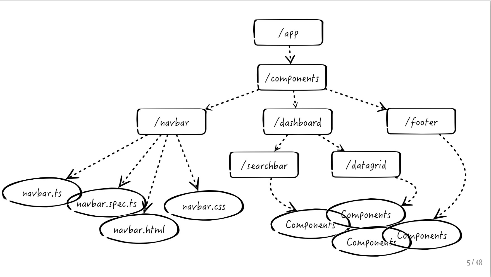
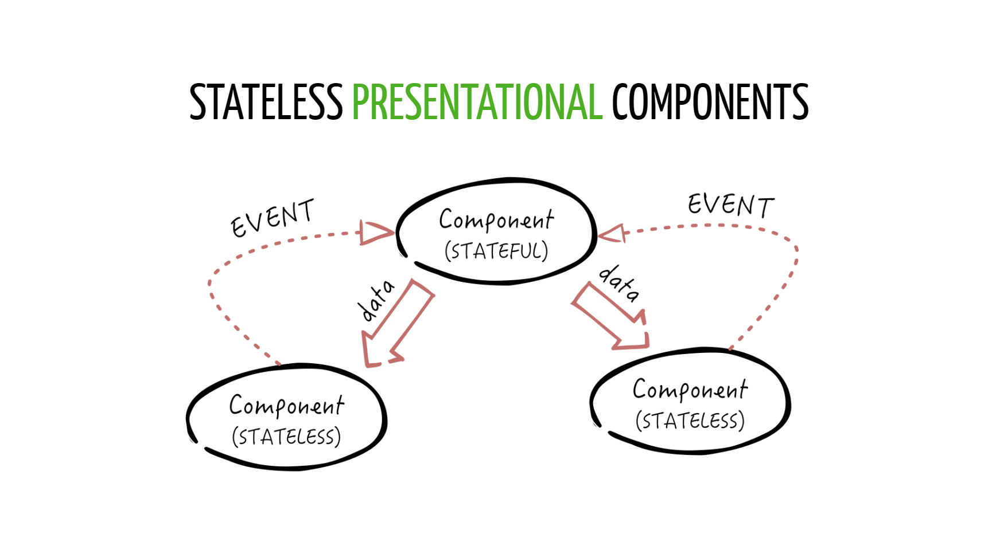

# ANGULAR6

---

## Components



---

## WHY COMPONENTS?

- Responsible for a portion of the view
- Reusable
- Componible
- Testable

---

## In Angular a Component:

- extends the HTML syntax creating new tags (i.e. <tab-bar>)
- is a class decorated by @Component and some metadata
- always has an HTML template
- has a lifecycle
- receives data by using @Input attributes
- communicates with the world by using @Output event emitters

---

## Projection

```html
<my-panel title="Hello">content here</my-panel>
<my-panel title="Hello">
  <input type="text" />
</my-panel>
```

---

Projection in Angular6n permette di avere uno stesso componente con contenuto diverso.

```javascript
import { Component, Input } from "@angular/core";
@Component({
  selector: "my-panel",
  template: `<div class="panel panel-info">
                <div class="panel-heading">
                  {{title}}
                </div>
                <div class="panel-body">
                  <ng-content></ng-content>    <!-- transclusion here -->
                </div>
             </div>`
})
export class MyPanelComponent {
  @Input() title;
}
```

---

## STATEFUL COMPONENT

Stateful Component è quel componente che ha al suo interno tutta la logica che gli
permette di sapere il suo stato e anche di cambiarlo. Registra al suo interno tutti i potenziali
cambi di stato dell'applicazione.

```javascript
import { Component, Input } from "@angular/core";
@Component({
  selector: "my-panel",
  template: `<div class="panel panel-info">
                <div class="panel-heading" (click)="toggle()">
                  {{title}}
                </div>
                <div class="panel-body" *ngIf="opened">
                  <ng-content></ng-content>  
                </div>
             </div>`
})
export class MyPanelComponent {
  @Input() title: string;
  opened = true;
  toggle() {
    this.opened = !this.opened;
  }
}
```

---

## STATELESS



---

## STATELESS COMPONENT

E' un componente il più semplice possibile che riceve informazioni dall'esterno ed a sua volta trasmette l'informazione ricevuta al componente genitore.

```javascript
import { Component, Input, Output, EventEmitter } from '@angular/core';
@Component({
  selector: 'my-panel',
  template: `<div class="panel panel-info">
                <div class="panel-heading" (click)="toggle.emit()">
                  {{title}}
                </div>
                <div class="panel-body" *ngIf="opened">
                  <ng-content></ng-content>
                </div>
              <div>`
})
export class MyPanelComponent {
  @Input() title: string;
  @Input() opened: boolean;
  @Output() toggle: EventEmitter<any> = new EventEmitter<any>();
}
```

---

## Change Detection

```js
export class AppComponent {
  courses = [
    { id: 1, name: "course1" },
    { id: 2, name: "course2" },
    { id: 3, name: "course3" }
  ];
}
onAdd(){
  this.courses.push({id:4,name:"courses4"})
}
```

---

```html
<button (click)="onAdd()">Add</button>
<ul>
  <li *ngFor="let course of courses">{{course.name}}</li>
</ul>
```

---

## \*ngFor and TrackBy

```js
export class AppComponent {
  courses;
  loadCourses() {
    this.courses = [
      { id: 1, name: "course1" },
      { id: 2, name: "course2" },
      { id: 3, name: "course3" }
    ];
  }
  trackCourse(index, course) {
    course ? course.id : undefined;
  }
}
```

---

```html
<button (click)="loadCourses()">Add</button>
<ul>
  <li *ngFor="let course of courses; trackBy: trackCourse">{{course.name}}</li>
</ul>
```

---

## ngIf

```html
<div *ngIf="courses.length > 0 ">
  List of courses
</div>
<div *ngIf="courses.length == 0 ">
  No courses yet
</div>
```

---

```html
<div *ngIf="courses.length > 0; then coursesList else noCourses"></div>
<ng-template #coursesList>
  List of courses
</ng-template>
<ng-template #noCourses>
  No courses yet
</ng-template>
```

---

## Reference and @ViewChild

The @ViewChild è un decorator che prende il nome del componente come input e recupera i metodi e le classi del componente figlio allínterno del componente padre.
@ViewChild puó essere passato anche come template reference variable.

---

```javascript
import { Component, ViewChild } from "@angular/core";
import { AlertComponent } from "./alert.component";

@Component({
  selector: "app-root",
  template: `
    <app-alert>My alert</app-alert>
      <button (click)="showAlert()">Show Alert</button>`
})
export class AppComponent {
  @ViewChild(AlertComponent) alert: AlertComponent;

  showAlert() {
    this.alert.show();
  }
}
```

---

## @ViewChild

```javascript
import { Component } from '@angular/core';
@Component({
	selector: 'app-alert',
	template:
	  <div *ngIf="!hidden">
  	  <div class="backdrop" (click)="hide()"></div>
	    <div class="modal">
	      <ng-content></ng-content>
	      <div>
  	      <button (click)="hide()">OK</button>
	      </div>
      </div>
	  </div>
  export class AlertComponent {
    hidden = true;
    show() {
      this.hidden = false;
    }
    hide() {
      this.hidden = true;
    }
```

---

## Esercizio

```html
<panel title="Dettagli di spedizione">
  Contenuto dettagli di spedizione
</panel>
<panel title="Dettagli di fatturazione">
  Contenuto dettagli di fatturazione
</panel>
```

---

```javascript
import { Component, OnInit, Input } from "@angular/core";
@Component({
  selector: "panel",
  templateUrl: "./panel.component.html",
  styleUrls: ["./panel.component.css"]
})
export class PanelComponent implements OnInit {
  @Input("title") title: string;
  isExpanded: boolean = true;
  toggle() {
    this.isExpanded = !this.isExpanded;
  }
}
```

---

```html
<div class="panel">
  <div class="panel-heading" [class.expanded]="isExpanded" (click)="toggle()">
    {{title}}
  </div>
  <div *ngIf="isExpanded" class="panel-body">
    <ng-content></ng-content>
  </div>
</div>
```

---

# LIFECYCLE

---

## COMPONENT LIFECYCLE

I componenti che costituiscono una applicazione Angular 6 vengono creati dinamicamente in base all’evoluzione dell’applicazione stessa.L’esistenza dei componenti durante l’esecuzione dell’applicazione attraversa diverse fasi che ne rappresentano il ciclo di vita. Angular 2 ci consente di intercettare e gestire in maniera personalizzata le varie fasi del ciclo di vita di un componente sfruttando i cosiddetti Lifecycle Hooks: un insieme di eventi in corrispondenza dei quali è possibile definire dei metodi per la loro gestione.

## [Lunga documentazione](https://angular.io/guide/lifecycle-hooks)

## Prima di ogni fase: l’esecuzione del costruttore

Prima di vedere nel dettaglio quali sono le fasi del ciclo di vita dei componenti, è opportuno evidenziare che la prima attività effettuata dal framework alla creazione di un componente è l’esecuzione del suo costruttore. Anche se tecnicamente non rappresenta un Lifecycle Hook, l’esecuzione del costruttore è quindi la fase iniziale della creazione di un componente Angular2. È da evidenziare tuttavia che in questa fase:

- non sono ancora state inizializzate le proprietà di input;
- non è ancora disponibile la view associata al componente stesso.

---

## Le fasi del ciclo di vita del componente

<em>OnChanges</em>
Si verifica quando il valore di una proprietà di input viene modificato. Oltre a verificarsi prima dell’inizializzazione del componente, si verifica anche ogni qualvolta cambia il valore delle proprietà di input<br>
<em>OnInit</em><br>
Rappresenta la fase di inizializzazione del componente e si verifica dopo il primo evento OnChanges. Questa fase viene eseguita una sola volta durante il ciclo di vita del componente.

---

---

<em>DoCheck</em></br>
Questa fase viene eseguita durante il check interno di Angular per valutare le modifiche ai componenti ed ai dati</br>
<em>AfterContentInit</em></br>
In questa fase il contenuto associato al componente è stato inizializzato; in particolare, è stato costruito l’albero degli eventuali componenti figli.</br>
<em>AfterContentChecked</em></br>
Anche questa fase viene eseguita durante un check interno di Angular sui contenuti associati al componente.</br>

---

---

<em>AfterViewInit</em></br>
Questa è la fase di inizializzazione della view associata al componente. In questa fase il componente risulta mappato sul DOM ed è quindi visibile.</br>
<em>AfterViewChecked</em></br>
Come per le altre fasi checked, anche in questo caso questa fase riguarda il check interno di Angular sulla view</br>
<em>OnDestroy</em></br>
Questa è l’ultima fase del ciclo di vita del componente e si verifica prima che Angular lo distrugga definitivamente.
Questa fase viene eseguita una sola volta durante il ciclo di vita del componente.

---

## Gestire le fasi del component lifecycle

L’approccio generale consiste nell’implementare una specifica interfaccia TypeScript il cui nome corrisponde alla fase da gestire. Ad esempio, se intendiamo gestire la fase OnInit di un componente dobbiamo implementare l’omonima interfaccia come mostrato di seguito:

```js
import { Component, OnInit } from "@angular/core";
@Component({
  selector: "articolo",
  templateUrl: "articolo.component.html",
  styleUrls: ["articolo.component.css"]
})
export class ArticoloComponent implements OnInit {
  constructor() {}
  ngOnInit() {
    console.log("Il componente è in fase di inizializzazione!");
  }
}
```

---

## FORM IN ANGULAR

---

```html
<form>
  <div class="form-group">
    <label for="email">Email address:</label>
    <input ngModel name="firstName" class="form-control" (change)="log()" id="firstName">
  </div>
  <div class="form-group">
    <label for="comment">Comment</label>
    <textarea ngModel name="comment" class="form-control" id="comment">
  </div>
  <div class="checkbox">
    <label><input type="checkbox"> Remember me</label>
  </div>
  <button type="submit" class="btn btn-default">Submit</button>
</form>
```

---
