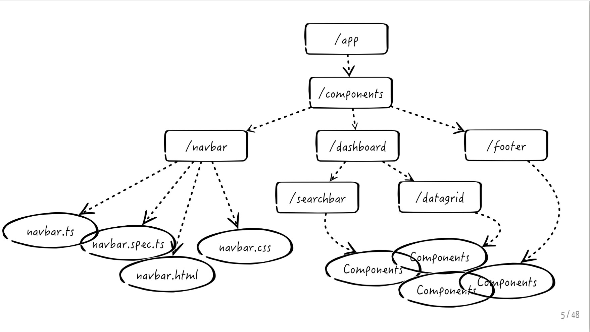
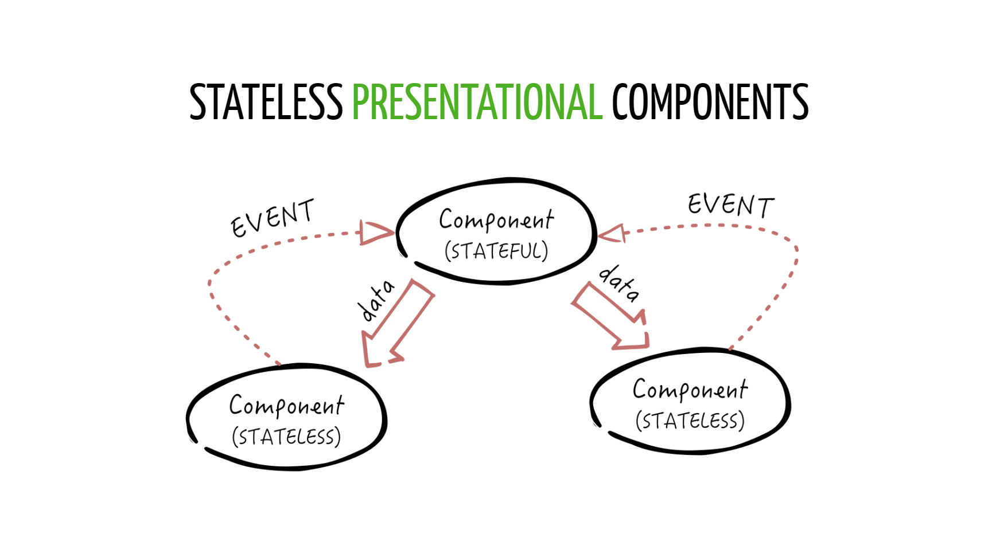

ANGULAR2
==================


----


Components
---------



----


WHY COMPONENTS?
----------------
* Responsible for a portion of the view
* Reusable
* Componible
* Testable


----


In Angular a Component:
-------
* extends the HTML syntax creating new tags (i.e. <tab-bar>)
* is a class decorated by @Component and some metadata
* always has an HTML template
* has a lifecycle
* receives data by using @Input attributes
* communicates with the world by using @Output event emitters


----


Projection
------------
```html
<my-panel title="Hello">content here</my-panel>
<my-panel title="Hello">
  <input type="text">
</my-panel>
```

----

Projection in Angular2 permette di avere uno stesso componente con contenuto diverso.

```javascript
import { Component, Input } from '@angular/core';
@Component({
  selector: 'my-panel',
  template: `<div class="panel panel-info">
                <div class="panel-heading">
                  {{title}}
                </div>
                <div class="panel-body">
                  <ng-content></ng-content>    <!-- transclusion here -->
                </div>
             </div>`
})
export class MyPanelComponent {
  @Input() title;
}
```


----


STATEFUL COMPONENT
------
I filtri sono funzioni utilizzabili nelle espressioni che permettono di
modificare i dati da visualizzare (eg. valute, date, upperCase,
ordinamento, etc...)

```javascript
import { Component, Input } from '@angular/core';
@Component({
  selector: 'my-panel',
  template: `<div class="panel panel-info">
                <div class="panel-heading" (click)="toggle()">
                  {{title}}
                </div>
                <div class="panel-body" *ngIf="opened">
                  <ng-content></ng-content>  
                </div>
             </div>`
})
export class MyPanelComponent {
  @Input() title: string;
  opened = true;
  toggle() {
    this.opened = !this.opened;
  }
}
```


----


STATELESS
------




---


STATELESS
-------------------
```javascript
import { Component, Input, Output, EventEmitter } from '@angular/core';
@Component({
  selector: 'my-panel',
  template: `<div class="panel panel-info">
                <div class="panel-heading" (click)="toggle.emit()">
                  {{title}}
                </div>
                <div class="panel-body" *ngIf="opened">
                  <ng-content></ng-content>
                </div>
              <div>`
})
export class MyPanelComponent {
  @Input() title: string;
  @Input() opened: boolean;
  @Output() toggle: EventEmitter<any> = new EventEmitter<any>();
}
```

---


Template reference variables
------


---

ESERCIZI
========


----


Random color
------------
Creare una direttiva di tipo tag chiamata set-color
che accetti il nome di un colore da un input.
Esso dovrà cambiare colore di background in base
al colore inserito.


----


Reverse
-------
Scrivere un filtro reverse che inverte una stringa
